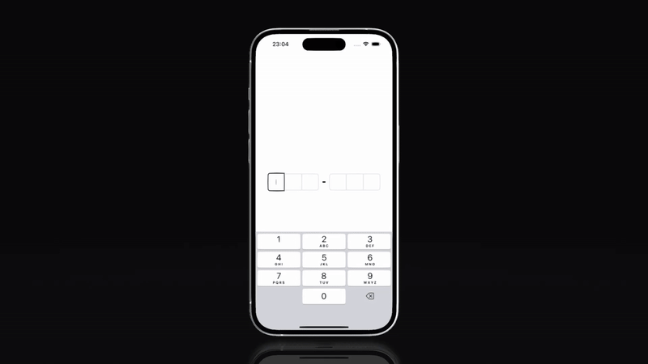

# react-native-input-code-otp

react-native-input-code-otp is a high-performance and fully customizable OTP input component for React Native, inspired @shadcn/ui.



## Installation

```sh
npm install react-native-input-code-otp
```

## Usage

```ts
import {
  TextInputOTP,
  TextInputOTPSlot,
  TextInputOTPGroup,
  TextInputOTPSeparator,
} from 'react-native-input-code-otp';

export function MyComponent() {
  return (
    <TextInputOTP maxLength={6} onFilled={(code) => console.log(code)}>
      <TextInputOTPGroup>
        <TextInputOTPSlot index={0} />
        <TextInputOTPSlot index={1} />
        <TextInputOTPSlot index={2} />
      </TextInputOTPGroup>
      <TextInputOTPSeparator />
      <TextInputOTPGroup>
        <TextInputOTPSlot index={3} />
        <TextInputOTPSlot index={4} />
        <TextInputOTPSlot index={5} />
      </TextInputOTPGroup>
    </TextInputOTP>
  )
}
```

## Contributing

Contributions are welcome! Please feel free to open issues or submit pull requests.

If you find a bug or have any feature requests, please open an issue :)

## License

This project is licensed under the MIT License.
